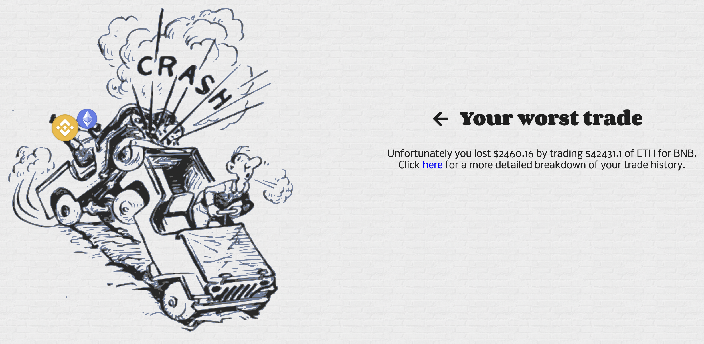
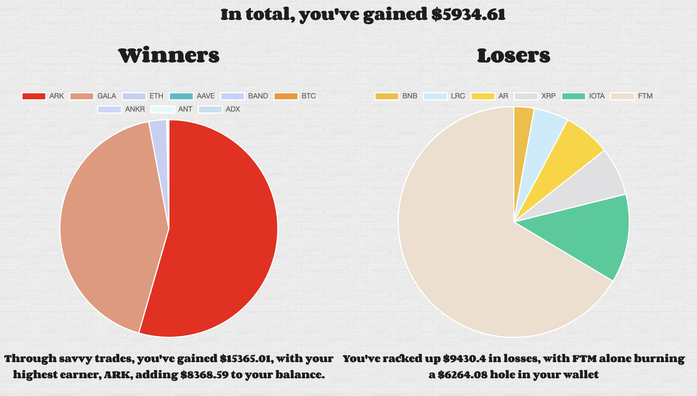

# <p align="center">Welcome to crypto gain or crypto pain!</p>
<p align="center">
  
  <!-- Icon from user Freepik at Flaticon -->
</p>

Ever wanted to see how cryptocurrencies are faring against each other? Look no further. Crypto gain or crypto pain allows you to see the exchange rates of all cryptocurrency trading pairs listed on [Binance](binance.com) and the degree to which this has changed in the past 24hrs.

## How it works
Provides an API with a frontend user interface for querying the past 24hrs of data on cryptocurrency trading pairs from binance. The data is fetched through binance's API and is hosted on a local sqlite database generated/updated on app startup. It shows price changes for trading pairs and indicates winners and losers in the past 24hrs (+/- 5% price change). Data is sortable and can be filtered by user input.
Users can also submit their own trades and see how they would have fared.


## Identify worst trade 

## Analysis of trading history


## Instructions
> You will need a binance API token in order for interactions with their API to work. Instructions for how to create one can be found here: https://www.binance.com/en/support/faq/360002502072. 

Once you have your token and secret token these should be placed in a .cfg file referenced in main.py e.g. `cfg.read("path/to/your/tokens.cfg")` with the following format:
```
[KEYS]
api_key: your-api-key
api_secret_key: your-api-secret-key
```
Install requirements
```
pip install -r requirements.txt
```
Inititate the app:
```
uvicorn main:app
```
Click url link displayed in terminal or open browser at http://127.0.0.1:8000 to view searchable table.

## Web Framework
- `FastAPI`
## Frontend
- `JavaScript/jQuery`
- `Jinja2 templating engine`
- `HTML & CSS`
- `Chart.js`
## Backend
- `Python`
- `SQLAlchemy with sqlite3`

***
Credit to Jonas Earendel for the original JavaScript and CSS which I adapted for the sort feature: https://github.com/tofsjonas/sortable.

Cryptocurrency icons from the excellent [Cryptoicons](https://github.com/monzanifabio/cryptoicons) project as well as from [Crypto Logos](https://cryptologos.cc/), https://github.com/coinwink/cryptocurrency-logos and https://github.com/spothq/cryptocurrency-icons.
